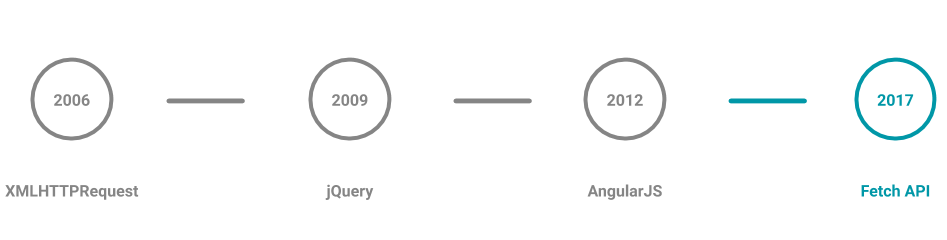
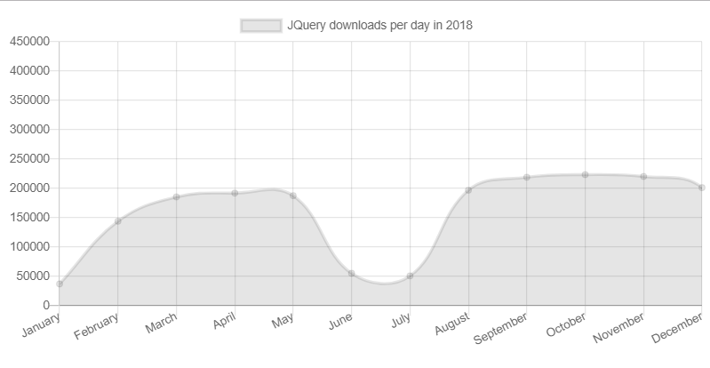
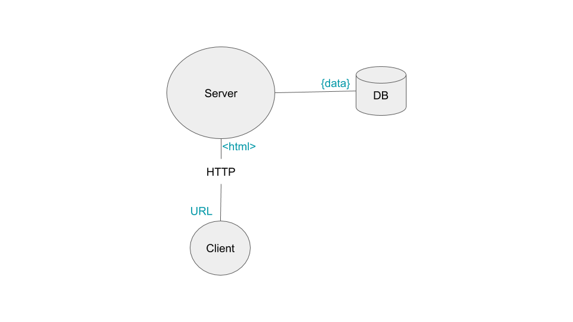
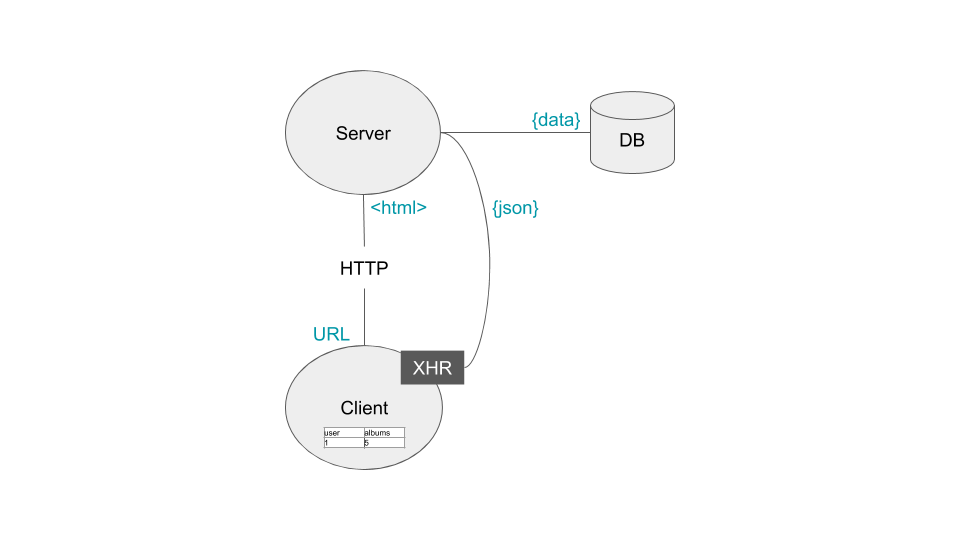
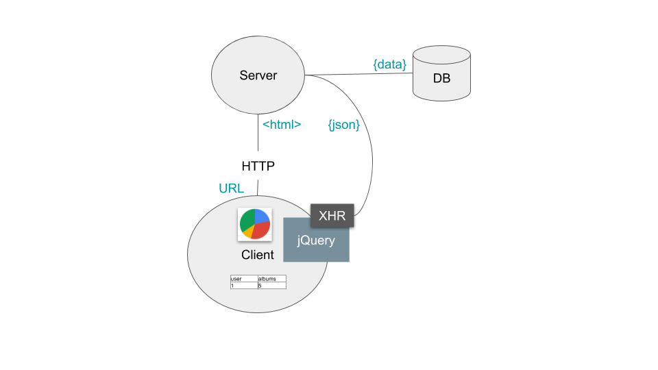
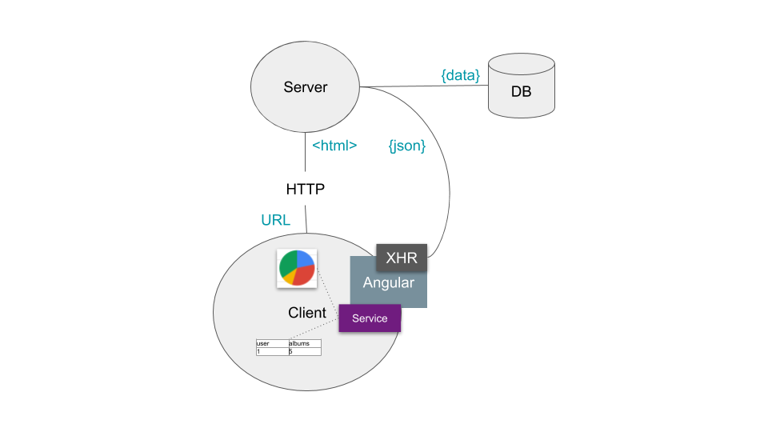
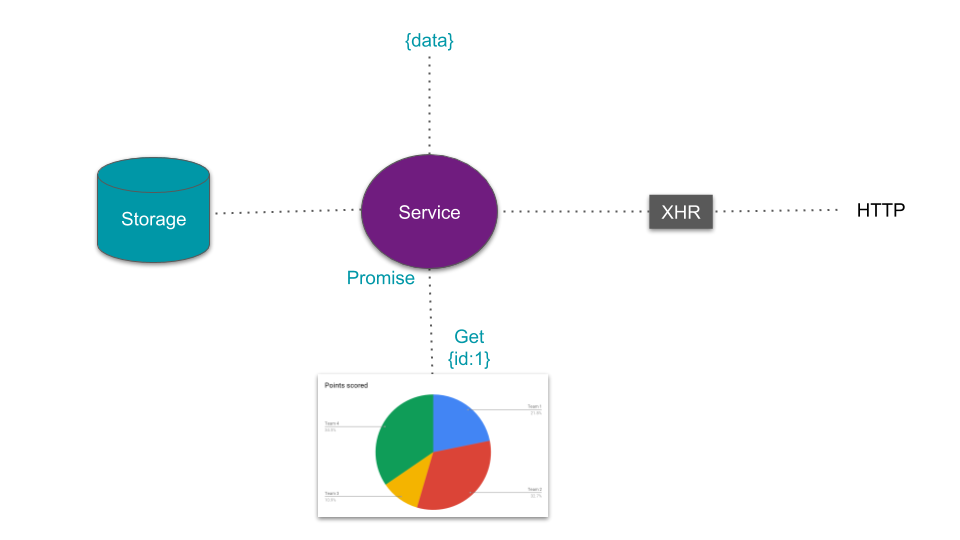
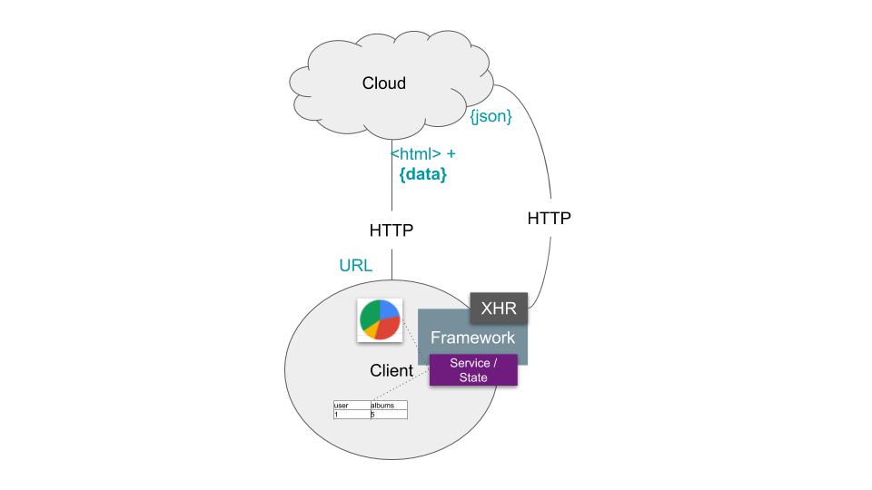
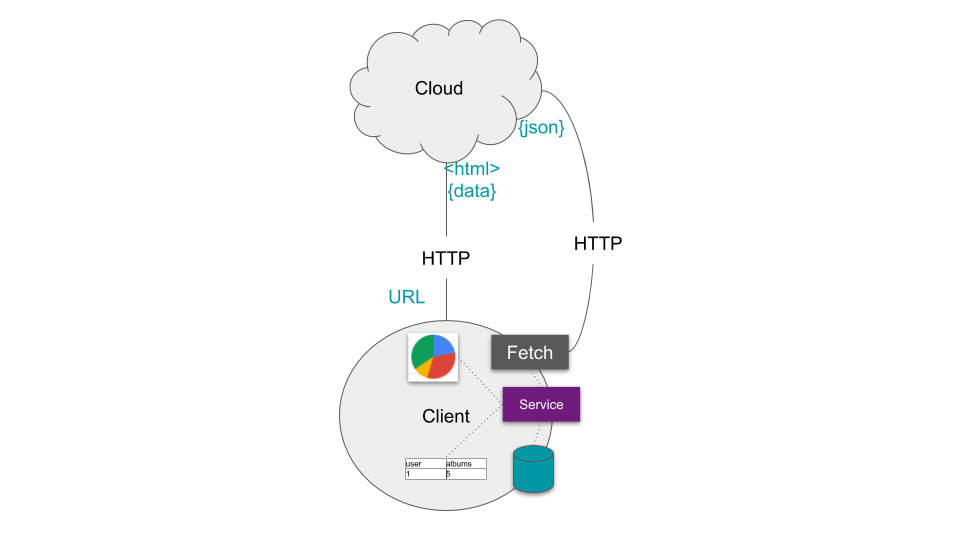
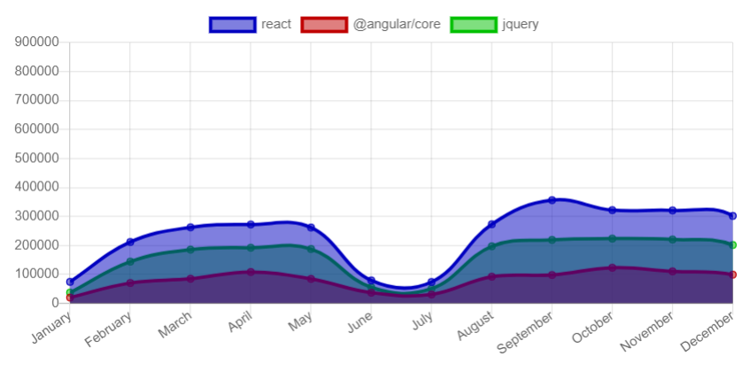

# Modern state of AJAX



Handling and manipulating data is one of essential needs of a Web application.

Web platform and approaches to deal with data have been evolving over time.

We will go through this evolution and highlight some key changes in the industry reviewing techniques we used before and now.

Let's use NPM stats of popular libraries like React, Angular, jQuery as a data source.

## Here is a public NPM API 

[https://api.npmjs.org/downloads/range/2018-01-01:2019-01-01/jquery](https://api.npmjs.org/downloads/range/2018-01-01:2019-01-01/jquery). 

## Data will be coming in a JSON format 

```json
{"start":"2018-12-24","end":"2019-06-22","package":"react","downloads":[{"downloads":240492,"day":"2018-12-24"},{"downloads":170145,"day":"2018-12-25"},{"downloads":304312,"day":"2018-12-26"},{"downloads":399011,"day":"2018-12-27"},{"downloads":350006,"day":"2018-12-28"},{"downloads":150378,"day":"2018-12-29"},{"downloads":126192,"day":"2018-12-30"},{"downloads":217976,"day":"2018-12-31"},{"downloads":121243,"day":"2019-01-01"}, ...]}
```

## Charts will help us to display the data



Ready to go back in time!? 3-2-1...

# Ancient times



 I started working as a Web developer when servers played a much bigger role in handling data. Browsers could only display HTML prepared on server.


# 2006. XMLHttpRequest and birth of AJAX

[XMLHttpRequest](https://developer.mozilla.org/en-US/docs/Web/API/XMLHttpRequest) (XHR) is an API in the form of an object whose methods transfer data between a web browser and a web server.

XMLHttpRequest object is used in the [AJAX](https://developer.mozilla.org/en-US/docs/Web/Guide/AJAX/Getting_Started) model to communicate with servers.



The idea [originated](https://en.wikipedia.org/wiki/XMLHttpRequest) in Microsoft and was first implemented in Internet Explorer 5 around 1999. Later it was standardized and adopted in all browsers by 2006.

## Example of using XMLHttpRequest
```js
var xhr = new XMLHttpRequest(); 
xhr.onload = console.log;
xhr.onerror = console.error;
xhr.open('GET', 'https://api.npmjs.org/downloads/range/2018-01-01:2019-01-01/jquery');
xhr.send();
```

Google Maps was one of the first adopters of this model showing the business value you can get in the products.

Browser support was not consistent at that time plus handling of various response types and errors required extra coding.


# 2006-2012. jQuery and Rise of data visualization 

[jQuery](https://jquery.com/) is one of the most successful javascript libraries in history. It is used in 73% of web sites in the world. 

jQuery was first released in 2006 introducing a helper to apply AJAX model. 



Many data visualization libraries emerged in parallel like [Highcharts](https://www.highcharts.com/).

## Example of using jQuery
```js
$.ajax({
	url: 'https://api.npmjs.org/downloads/range/2018-01-01:2019-01-01/jquery',
	method: 'GET'
}).fail(console.error).done(console.log);
```

We witnessed a shift of complexity in our websites from server to client and our servers became thinner.

# 2012-2014 AngularJS. Frameworks era starts.

I have been working with many frameworks including Ext.js, KnockoutJs, AngularJS, ReactJS, Angular, Polymer. 

AngularJS became a widely adopted library.



## Example of using AJAX in Angular v1.x

```html
<script src="https://ajax.googleapis.com/ajax/libs/angularjs/1.7.8/angular.min.js"></script>
<div ng-app="app" ng-controller="ctrl">
</div>
<script>
	var app = angular.module('app', []);
	app.controller('ctrl', function ($scope, $http) {
		$http.get('https://api.npmjs.org/downloads/range/2018-01-01:2019-01-01/@angular/core').then(console.log);
	});
</script>
```
We can see new patterns were promoted by frameworks like `Service`. 

# Service pattern

Service can help us to abstract how we get and manipulate data from our UI components.



Such a model gives a flexibility to use various sources of data but provide a consistent API returning something predictable like [Promise](https://developer.mozilla.org/en-US/docs/Web/JavaScript/Guide/Using_promises).

```js
class Service {
	get(params) {
		return new Promise((resolve, reject) => {
			resolve({test:1});
		});
	}
}

let myService = new Service();
myService.get({})
	.then(console.log);
```

Promises are very handy in such cases. You could process the results applying [functional composition](https://hackernoon.com/functional-programming-paradigms-in-modern-javascript-function-composition-109670038859).

```js
myService.get()
	.then(data => data.test)
	.then(value => value + 1) 
	.then(console.log); //2
```

We could run several Promises in parallel. 

```js
Promise.all([
	myService.get(),
	myService.get()
]).then(console.table); //[{test:1},{test:1}]
```

# 2015. Sever Side Rendering is back

Industry realized that we cannot just dump everything on the client-side. We need to keep a healthy balance and distribute complexity we have to solve.

Only such a balanced approach could enable a top class performance for our apps.




# Fetch API 2017 and beyond.

Chrome [shipped](https://developers.google.com/web/updates/2015/03/introduction-to-fetch) Fetch API in 2015 and later it was adopted by all modern browsers.



```js
fetch('https://api.npmjs.org/downloads/range/2018-01-01:2019-01-01/react').then(response => response.json()).then(console.log);
```
 Fetch API wraps XMLHTTPRequest in Promises. This is exactly what we need! Even ReactJS team [recommends](https://reactjs.org/docs/faq-ajax.html) to use Fetch for AJAX calls.

IE11 can be supplied with a tiny [polyfill](https://github.com/github/fetch).
# Final Solution




# Value we get and Next steps

* Web platform gives us some very good options to work with HTTP we should try first before exploring libraries.
* Understanding HTTP and using Web APIs becomes a critical skill for engineers along with HTML, CSS and JS.
* Using Web platform APIs would extend the life-span of our solutions making them more efficient and easy to maintain.

Please share your experience using Fetch API. Do you use any libraries for that? Do you create custom abstractions like `Services`?